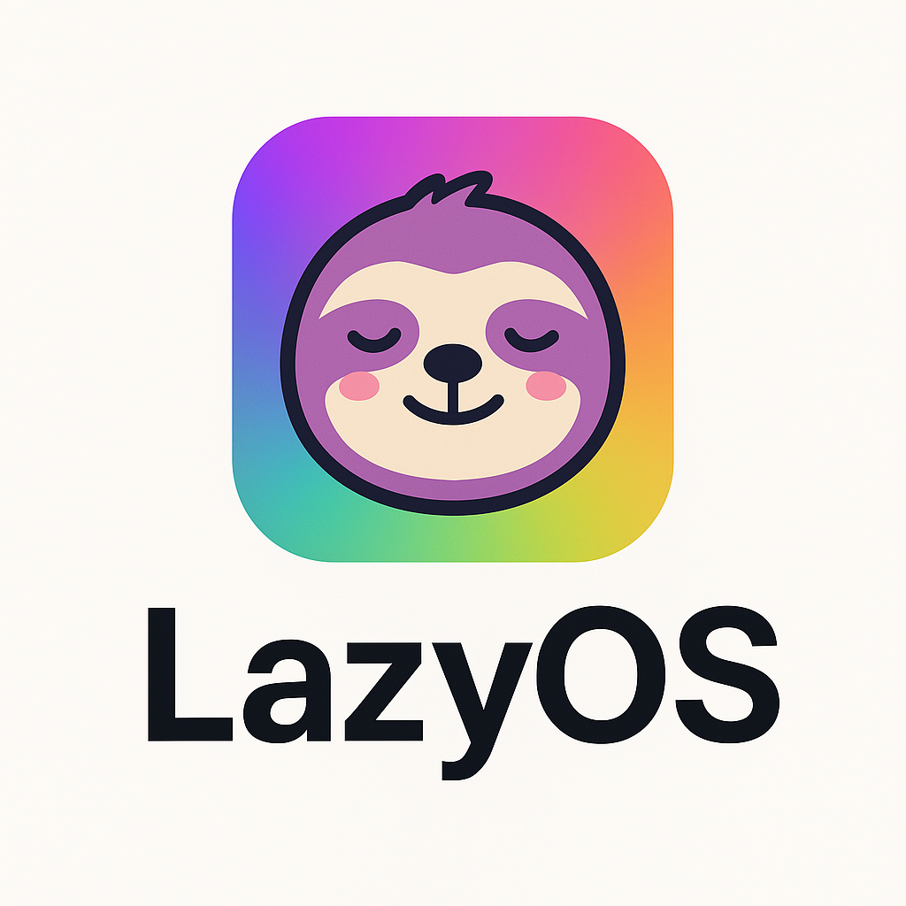

✨ Local-first personal operating layer for your digital life. 🧠 Powered by Ayo, the smart assistant that adapts to your habits, organizes your flow, and kills your tedious tasks.

# LazyOS · Powered by Ayo 🧠

> Your local-first, behavior-aware personal operating system layer.

LazyOS is a lightweight, cross-platform smart assistant that learns your habits, automates your daily workflows, manages browser clutter, and keeps your system clean — all while respecting your privacy.

## 🎯 Coming Soon

- 🔁 One-click context switching (Work, Chill, Learn, Sleep)
- 🌐 Smart browser tab organizer & launcher
- 📁 Auto-cleanup of old files, unused apps & downloads
- 🧠 Pattern recognition (offline/local ML)
- 🎙️ Offline voice command support (Vosk/Whisper)
- 📊 Local activity dashboard (time in each mode, app usage)
- ⚙️ CLI + GUI interface with floating launcher (DearPyGui)
- Plugin system for devs to create custom workflows
- Cross-device profile sync (optional, encrypted)
- Community-driven mode templates

## 🚀 Getting Started

Coming soon.

## 🛡️ Philosophy

No cloud. No tracking. Just automation that feels like magic.

---

## 🔗 Project Status

🚧 Currently in early prototyping phase. MVP is CLI + tab launcher + file cleanup system.

---

Made with love by [@yugantm](https://github.com/yugantm)
